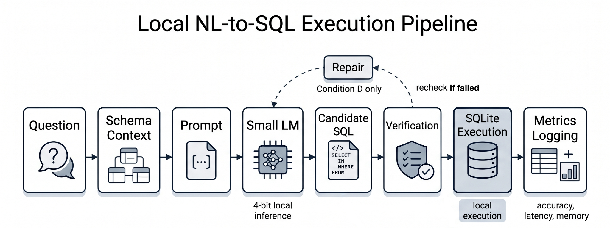
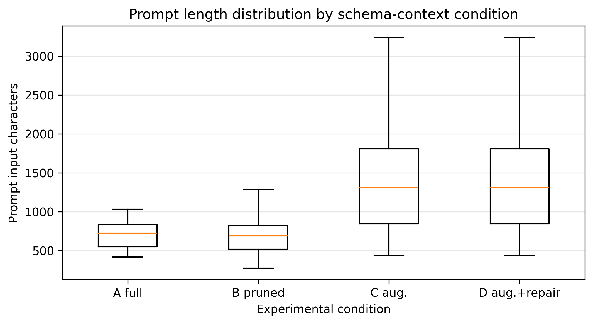
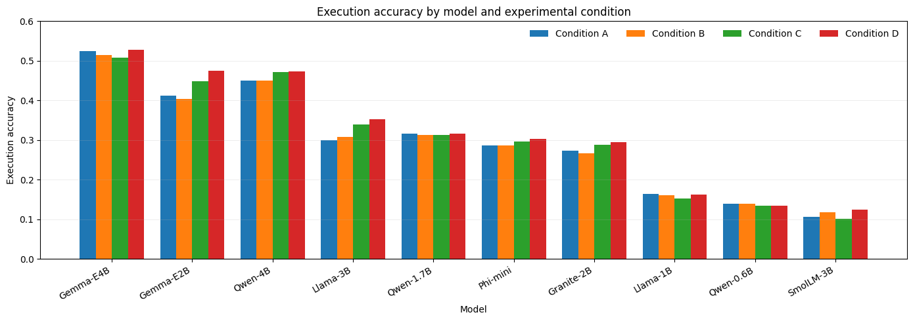
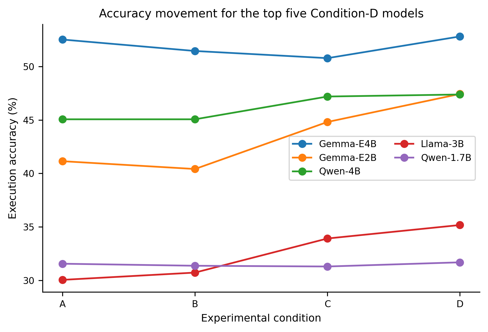
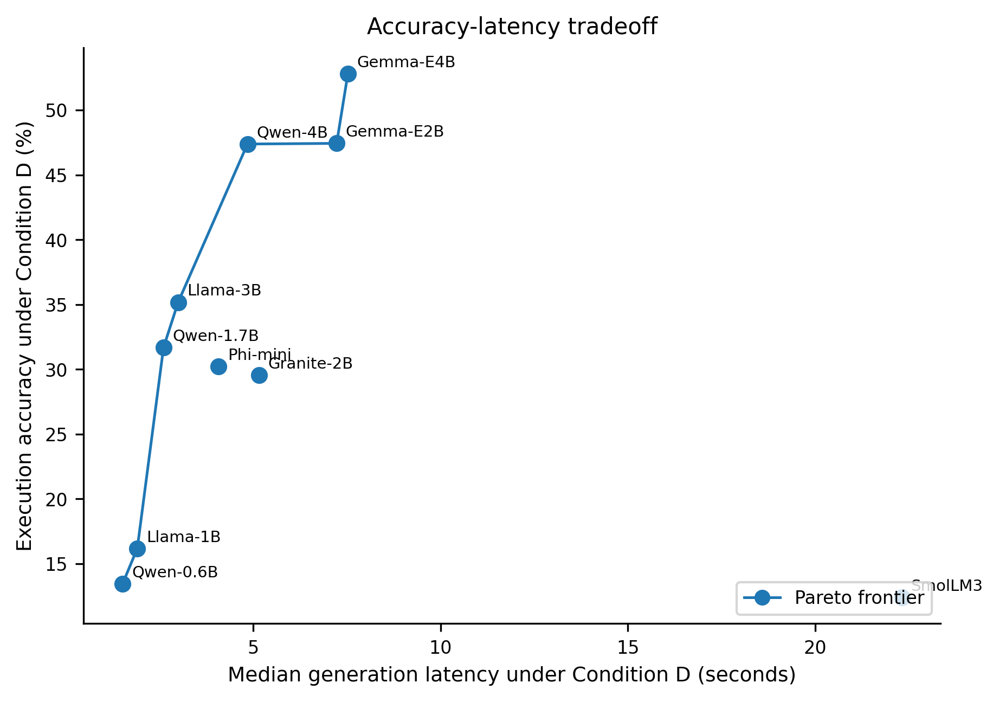
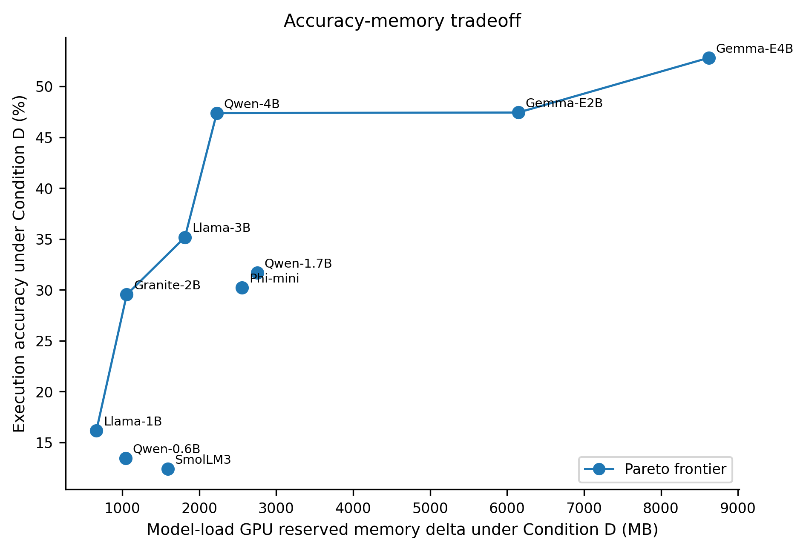
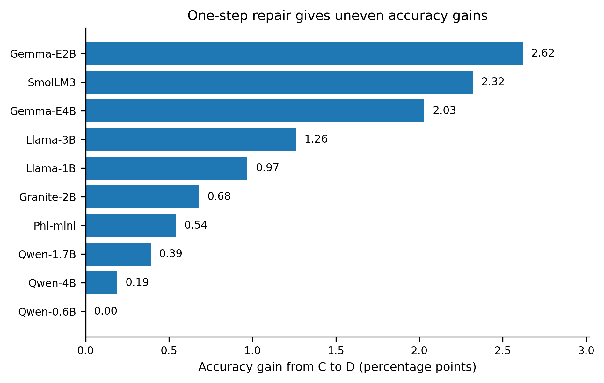

# A Benchmark of Small Language Models for Local Text-to-SQL over SQLite

This repository contains the notebooks, generated benchmark outputs, and figures for the paper:

**A Benchmark of Small Language Models for Local Text-to-SQL over SQLite**  
**Author:** Ha Viet Thang, FPT University, Can Tho, Vietnam

The project evaluates compact instruction-tuned language models for local natural-language-to-SQL generation over embedded SQLite databases. The benchmark uses the Spider 1.0 development set, direct SQLite execution, 4-bit NF4 quantization, lightweight SQL verification, and four schema-context/repair conditions.

---

## Repository layout

```text
A-Benchmark-of-Small-Language-Models-for-Local-Text-to-SQL-over-SQLite/
├── README.md
├── notebooks/
│   ├── APWEB_WAIM_2026_Text_to_SQL_SLMs.ipynb
│   └── APWEB_WAIM_2026_Benchmark_Design_Materials_Generator.ipynb
├── figures/
│   ├── fig_benchmark_pipeline.png
│   ├── fig_prompt_length_by_condition.png
│   ├── fig_execution_accuracy_by_condition.png
│   ├── fig_top5_accuracy_by_condition.png
│   ├── fig_pareto_accuracy_latency.png
│   ├── fig_pareto_accuracy_memory.png
│   └── fig_repair_accuracy_gain.png
└── results/
    ├── all_models_main_metrics.csv
    ├── all_models_analytic_subset_metrics.csv
    ├── all_models_error_breakdown.csv
    ├── resource_aware_rank.csv
    ├── rank_by_execution_accuracy.csv
    ├── rank_by_executable_query_rate.csv
    ├── rank_by_median_generation_latency.csv
    ├── rank_by_model_load_memory.csv
    ├── model_file_status.csv
    ├── all_model_outputs.csv
    └── spider_dev_analytic_subset.csv
```

No `requirements.txt` file is currently included in the uploaded artifact. The notebooks contain the setup cells used for the Colab experiments.

---

## Data setup for reproduction

The experiments use the **Spider 1.0 development set** and the original Spider SQLite database files. These files should be downloaded separately from the official Spider release and placed locally in this layout:

```text
data/spider/
├── dev.json
├── tables.json
└── database/
```

The notebooks expect access to Spider development examples, Spider schema metadata, and the original SQLite database files. The repository should not redistribute the SQLite databases unless redistribution rights are explicitly confirmed.

---

## Notebooks

### `notebooks/APWEB_WAIM_2026_Text_to_SQL_SLMs.ipynb`

Main benchmark notebook. It contains the end-to-end experimental pipeline:

1. environment setup;
2. model list and benchmark configuration;
3. Hugging Face login through an `HF_TOKEN` environment variable or Colab secret;
4. 4-bit NF4 model loading;
5. Spider development-set loading;
6. full, pruned, and augmented schema-context construction;
7. prompt construction;
8. local model inference;
9. SQL extraction;
10. lightweight SQL verification;
11. SQLite execution;
12. execution-accuracy and executable-rate computation;
13. latency and memory logging;
14. repair-pass evaluation;
15. analytical-subset evaluation;
16. CSV/figure/table export.

### `notebooks/APWEB_WAIM_2026_Benchmark_Design_Materials_Generator.ipynb`

Support notebook for paper materials. It does **not** run full model inference. It generates benchmark-design material such as prompt listings, schema-context examples, prompt/context-length summaries, verification/repair diagrams, example tables, and paper-ready LaTeX snippets.

---

## Models evaluated

| Model name | Model ID | Completed pairs |
| --- | --- | ---: |
| Qwen3-0.6B | Qwen/Qwen3-0.6B | 4130 / 4136 |
| Qwen3-1.7B | Qwen/Qwen3-1.7B | 4116 / 4136 |
| Qwen3-4B-Instruct-2507 | Qwen/Qwen3-4B-Instruct-2507 | 4128 / 4136 |
| Gemma-4-E2B-it | google/gemma-4-E2B-it | 4127 / 4136 |
| Gemma-4-E4B-it | google/gemma-4-E4B-it | 4128 / 4136 |
| Llama-3.2-1B-Instruct | meta-llama/Llama-3.2-1B-Instruct | 4130 / 4136 |
| Llama-3.2-3B-Instruct | meta-llama/Llama-3.2-3B-Instruct | 4128 / 4136 |
| Granite-3.3-2B-Instruct | ibm-granite/granite-3.3-2b-instruct | 4132 / 4136 |
| SmolLM3-3B | HuggingFaceTB/SmolLM3-3B | 4132 / 4136 |
| Phi-4-mini-instruct | microsoft/Phi-4-mini-instruct | 4129 / 4136 |

Model weights are not redistributed. The notebooks load the models from their original model repositories.

---

## Experimental conditions

| Condition | Schema context | Repair |
|---|---|---|
| A | Full schema | Disabled |
| B | Conservative pruned schema | Disabled |
| C | Conservative pruned + augmented schema | Disabled |
| D | Conservative pruned + augmented schema | Enabled |

Condition D differs from Condition C only by allowing one verification-triggered repair attempt. Executable but semantically wrong SQL does not trigger repair.

---

## Released Dataset

The generated benchmark outputs are released on Kaggle:

**Local Text-to-SQL over SQLite with Small Language Models**  
https://www.kaggle.com/datasets/michaelhafpt/local-text-to-sql-over-sqlite-with-slms

This Kaggle artifact contains generated model outputs and benchmark logs for the local Text-to-SQL experiments. It includes per-model JSONL outputs and a combined Parquet output file for analysis.

Some files include Spider-derived fields such as natural-language questions, gold SQL, database identifiers, and schema-context information. Because of this, users should also cite the original Spider 1.0 paper when using the dataset.

---

## Figures

### Local NL-to-SQL execution pipeline



The pipeline runs from question and schema context to prompt construction, local small-language-model inference, candidate SQL extraction, lightweight verification, SQLite execution, and metric logging. The repair loop is used only in Condition D after verification failure.

### Prompt length distribution by condition



This figure shows how schema-context choice changes prompt length. Conditions C and D are longer because they add types, keys, foreign-key information, and sample values.

### Execution accuracy by model and condition



This grouped bar chart compares all ten models under Conditions A--D.

### Accuracy movement for the top five Condition-D models



This line chart focuses on the five models with the highest Condition-D execution accuracy.

### Accuracy-latency tradeoff



This scatter plot compares Condition-D execution accuracy with median generation latency. The connected line marks the nondominated Pareto frontier.

### Accuracy-memory tradeoff



This scatter plot compares Condition-D execution accuracy with model-load GPU reserved-memory delta. It shows why the most accurate model is not always the most resource-efficient local choice.

### Repair accuracy gain



This chart shows that one-step repair gives uneven gains. It helps most when errors are detectable by the lightweight verifier.

---

## Main results from `results/all_models_main_metrics.csv`

### Condition-D summary

| Model | Acc. D (%) | Exec. D (%) | Median latency (s) | Load memory (MB) | Repair attempt (%) |
| --- | ---: | ---: | ---: | ---: | ---: |
| Gemma-4-E4B-it | 52.81 | 95.74 | 7.53 | 8620 | 7.46 |
| Gemma-4-E2B-it | 47.43 | 96.12 | 7.23 | 6146 | 9.89 |
| Qwen3-4B-Instruct-2507 | 47.38 | 98.16 | 4.85 | 2228 | 2.71 |
| Llama-3.2-3B-Instruct | 35.17 | 87.40 | 3.00 | 1814 | 18.51 |
| Qwen3-1.7B | 31.68 | 87.95 | 2.61 | 2754 | 14.67 |
| Phi-4-mini-instruct | 30.16 | 92.53 | 4.08 | 2558 | 9.60 |
| Granite-3.3-2B-Instruct | 29.53 | 85.00 | 5.16 | 1058 | 18.97 |
| Llama-3.2-1B-Instruct | 16.18 | 59.01 | 1.91 | 664 | 47.87 |
| Qwen3-0.6B | 13.46 | 73.38 | 1.52 | 1044 | 27.78 |
| SmolLM3-3B | 12.40 | 35.08 | 22.31 | 1590 | 73.35 |

### Accuracy across all four conditions

Accuracy and executable rates are percentages. Latency is in seconds. Memory is model-load GPU reserved-memory delta in MB.

| Model | Acc. A | Acc. B | Acc. C | Acc. D | Exec. D | Lat. D | Mem. D |
| --- | ---: | ---: | ---: | ---: | ---: | ---: | ---: |
| Gemma-4-E4B-it | 52.52 | 51.45 | 50.78 | 52.81 | 95.74 | 7.53 | 8620 |
| Gemma-4-E2B-it | 41.14 | 40.41 | 44.81 | 47.43 | 96.12 | 7.23 | 6146 |
| Qwen3-4B-Instruct-2507 | 45.06 | 45.06 | 47.19 | 47.38 | 98.16 | 4.85 | 2228 |
| Llama-3.2-3B-Instruct | 30.04 | 30.72 | 33.91 | 35.17 | 87.40 | 3.00 | 1814 |
| Qwen3-1.7B | 31.58 | 31.39 | 31.29 | 31.68 | 87.95 | 2.61 | 2754 |
| Phi-4-mini-instruct | 28.49 | 28.59 | 29.69 | 30.16 | 92.53 | 4.08 | 2558 |
| Granite-3.3-2B-Instruct | 27.30 | 26.72 | 28.85 | 29.53 | 85.00 | 5.16 | 1058 |
| Llama-3.2-1B-Instruct | 16.36 | 16.07 | 15.21 | 16.18 | 59.01 | 1.91 | 664 |
| Qwen3-0.6B | 13.87 | 13.95 | 13.46 | 13.46 | 73.38 | 1.52 | 1044 |
| SmolLM3-3B | 10.64 | 11.80 | 10.08 | 12.40 | 35.08 | 22.31 | 1590 |

---

## Resource-aware ranking from `results/resource_aware_rank.csv`

The resource-aware score combines normalized execution accuracy, executable-query rate, latency efficiency, and memory efficiency using the paper's accuracy-first weighting.

| Rank | Model | Score | Acc. D (%) | Exec. D (%) | Latency (s) | Memory (MB) |
| ---: | --- | ---: | ---: | ---: | ---: | ---: |
| 1 | Qwen3-4B-Instruct-2507 | 0.881 | 47.38 | 98.16 | 4.85 | 2228 |
| 2 | Gemma-4-E4B-it | 0.835 | 52.81 | 95.74 | 7.53 | 8620 |
| 3 | Gemma-4-E2B-it | 0.803 | 47.43 | 96.12 | 7.23 | 6146 |
| 4 | Llama-3.2-3B-Instruct | 0.719 | 35.17 | 87.40 | 3.00 | 1814 |
| 5 | Qwen3-1.7B | 0.669 | 31.68 | 87.95 | 2.61 | 2754 |
| 6 | Phi-4-mini-instruct | 0.654 | 30.16 | 92.53 | 4.08 | 2558 |
| 7 | Granite-3.3-2B-Instruct | 0.630 | 29.53 | 85.00 | 5.16 | 1058 |
| 8 | Qwen3-0.6B | 0.430 | 13.46 | 73.38 | 1.52 | 1044 |
| 9 | Llama-3.2-1B-Instruct | 0.419 | 16.18 | 59.01 | 1.91 | 664 |
| 10 | SmolLM3-3B | 0.088 | 12.40 | 35.08 | 22.31 | 1590 |

---

## Repair results from Condition C to Condition D

| Model | Acc. C | Acc. D | Acc. gain | Exec. C | Exec. D | Exec. gain | Repair % | Repair lat. |
| --- | ---: | ---: | ---: | ---: | ---: | ---: | ---: | ---: |
| Gemma-4-E4B-it | 50.78 | 52.81 | 2.03 | 92.54 | 95.74 | 3.20 | 7.46 | 0.99 |
| Gemma-4-E2B-it | 44.81 | 47.43 | 2.62 | 90.11 | 96.12 | 6.01 | 9.89 | 0.87 |
| Qwen3-4B-Instruct-2507 | 47.19 | 47.38 | 0.19 | 97.29 | 98.16 | 0.87 | 2.71 | 0.20 |
| Llama-3.2-3B-Instruct | 33.91 | 35.17 | 1.26 | 81.49 | 87.40 | 5.91 | 18.51 | 0.85 |
| Qwen3-1.7B | 31.29 | 31.68 | 0.39 | 85.33 | 87.95 | 2.62 | 14.67 | 0.79 |
| Phi-4-mini-instruct | 29.69 | 30.16 | 0.47 | 90.23 | 92.53 | 2.30 | 9.60 | 1.15 |
| Granite-3.3-2B-Instruct | 28.85 | 29.53 | 0.68 | 81.03 | 85.00 | 3.97 | 18.97 | 1.78 |
| Llama-3.2-1B-Instruct | 15.21 | 16.18 | 0.97 | 52.13 | 59.01 | 6.88 | 47.87 | 1.23 |
| Qwen3-0.6B | 13.46 | 13.46 | 0.00 | 72.22 | 73.38 | 1.16 | 27.78 | 1.88 |
| SmolLM3-3B | 10.08 | 12.40 | 2.33 | 26.65 | 35.08 | 8.43 | 73.35 | 15.65 |

---

## Analytical-subset results from `results/all_models_analytic_subset_metrics.csv`

The analytical subset contains Spider development examples whose gold SQL includes structural features such as joins, multiple tables, aggregation, grouping, ordering, limits, or nested queries.

| Model | Main acc. | Analytic acc. | Drop | Main exec. | Analytic exec. |
| --- | ---: | ---: | ---: | ---: | ---: |
| Gemma-4-E4B-it | 52.81 | 47.43 | 5.38 | 95.74 | 94.97 |
| Gemma-4-E2B-it | 47.43 | 43.02 | 4.41 | 96.12 | 95.77 |
| Qwen3-4B-Instruct-2507 | 47.38 | 40.57 | 6.81 | 98.16 | 97.83 |
| Llama-3.2-3B-Instruct | 35.17 | 28.00 | 7.17 | 87.40 | 86.17 |
| Qwen3-1.7B | 31.68 | 24.71 | 6.97 | 87.95 | 86.50 |
| Phi-4-mini-instruct | 30.16 | 21.28 | 8.88 | 92.53 | 91.65 |
| Granite-3.3-2B-Instruct | 29.53 | 23.29 | 6.24 | 85.00 | 83.68 |
| Llama-3.2-1B-Instruct | 16.18 | 12.57 | 3.61 | 59.01 | 56.91 |
| Qwen3-0.6B | 13.46 | 7.08 | 6.38 | 73.38 | 70.21 |
| SmolLM3-3B | 12.40 | 6.74 | 5.66 | 35.08 | 32.57 |

---

## Result-file schemas

**`results/all_models_main_metrics.csv`**

```text
model_name, condition, n_examples, execution_accuracy, executable_query_rate, exact_match_accuracy, median_generation_latency_sec, mean_generation_latency_sec, p95_generation_latency_sec, mean_prompt_input_chars, mean_schema_context_chars, mean_schema_compression_ratio, gold_table_recall, gold_column_recall, pruning_failure_rate, mean_model_load_gpu_reserved_delta_mb, mean_runtime_gpu_peak_delta_mb, mean_runtime_cpu_delta_mb, repair_attempt_rate, mean_repair_latency_sec
```

**`results/all_models_analytic_subset_metrics.csv`**

```text
model_name, condition, n_examples, execution_accuracy, executable_query_rate, exact_match_accuracy, median_generation_latency_sec, mean_generation_latency_sec, p95_generation_latency_sec, mean_prompt_input_chars, mean_schema_context_chars, mean_schema_compression_ratio, gold_table_recall, gold_column_recall, pruning_failure_rate, mean_model_load_gpu_reserved_delta_mb, mean_runtime_gpu_peak_delta_mb, mean_runtime_cpu_delta_mb, repair_attempt_rate, mean_repair_latency_sec
```

**`results/all_models_error_breakdown.csv`**

```text
model_name, condition, verification_status, count, total, rate
```

**`results/resource_aware_rank.csv`**

```text
model_name, condition, n_examples, execution_accuracy, executable_query_rate, exact_match_accuracy, median_generation_latency_sec, mean_generation_latency_sec, p95_generation_latency_sec, mean_prompt_input_chars, mean_schema_context_chars, mean_schema_compression_ratio, gold_table_recall, gold_column_recall, pruning_failure_rate, mean_model_load_gpu_reserved_delta_mb, mean_runtime_gpu_peak_delta_mb, mean_runtime_cpu_delta_mb, repair_attempt_rate, mean_repair_latency_sec, accuracy_score, exec_rate_score, latency_score, memory_score, resource_aware_score, resource_aware_rank
```

**`results/model_file_status.csv`**

```text
model_name, model_id, file_exists, rows, completed_pairs, expected_pairs, complete
```

**`results/all_model_outputs.csv`**

```text
example_id, db_id, question, gold_sql, model_name, model_id, condition, context_mode, verification_enabled, repair_enabled, schema_context, schema_context_chars, full_schema_chars, schema_compression_ratio, selected_tables, gold_table_recall, gold_column_recall, pruning_failure, prompt_input_chars, prompt_input_tokens, raw_output, generated_sql, final_sql, extraction_status, verification_status, verification_error_message, verification_latency_sec, generation_latency_sec, repair_attempted, repair_sql, repair_raw_output, repair_extraction_status, repair_latency_sec, gold_exec_ok, pred_exec_ok, execution_correct, gold_exec_error, pred_exec_error, model_load_time_sec, model_load_cpu_delta_mb, model_load_gpu_allocated_delta_mb, model_load_gpu_reserved_delta_mb, runtime_cpu_delta_mb, runtime_gpu_allocated_delta_mb, runtime_gpu_reserved_delta_mb, runtime_gpu_peak_delta_mb, total_system_cpu_rss_mb, fatal_error
```

**`results/spider_dev_analytic_subset.csv`**

```text
example_id, db_id, question, gold_sql
```

---

## Reproducing the benchmark

1. Clone this repository.
2. Download Spider 1.0 separately and place it under `data/spider/`.
3. Open `notebooks/APWEB_WAIM_2026_Text_to_SQL_SLMs.ipynb` in Google Colab or Jupyter.
4. Configure the project paths in the notebook.
5. Set any required model-access tokens through environment variables or Colab Secrets, not hard-coded strings.
6. Run the benchmark cells to regenerate outputs.
7. Run the material-generation notebook if paper figures/tables need to be regenerated.

Example local layout:

```text
data/spider/dev.json
data/spider/tables.json
data/spider/database/
```

---

## Spider 1.0 Citation

This benchmark is based on the Spider 1.0 development set. Spider is a large-scale cross-domain semantic parsing and Text-to-SQL dataset with 10,181 questions, 5,693 unique SQL queries, and 200 databases across 138 domains. The official Spider page describes Spider as a complex and cross-domain benchmark for natural-language interfaces to relational databases.

If you use this repository or the released Kaggle dataset, please cite the original Spider paper:

```bibtex
@inproceedings{yu-etal-2018-spider,
  title     = {{S}pider: A Large-Scale Human-Labeled Dataset for Complex and Cross-Domain Semantic Parsing and Text-to-{SQL} Task},
  author    = {Yu, Tao and Zhang, Rui and Yang, Kai and Yasunaga, Michihiro and Wang, Dongxu and Li, Zifan and Ma, James and Li, Irene and Yao, Qingning and Roman, Shanelle and Zhang, Zilin and Radev, Dragomir},
  booktitle = {Proceedings of the 2018 Conference on Empirical Methods in Natural Language Processing},
  year      = {2018},
  address   = {Brussels, Belgium},
  publisher = {Association for Computational Linguistics},
  pages     = {3911--3921},
  doi       = {10.18653/v1/D18-1425},
  url       = {https://aclanthology.org/D18-1425/}
}
```
---

## Citation

If you use this benchmark code or generated results, please cite:

```bibtex
@inproceedings{ha2026localtexttosql,
  title     = {A Benchmark of Small Language Models for Local Text-to-SQL over SQLite},
  author    = {Ha Viet Thang},
  booktitle = {To appear},
  year      = {2026},
  note      = {To appear}
}
```
